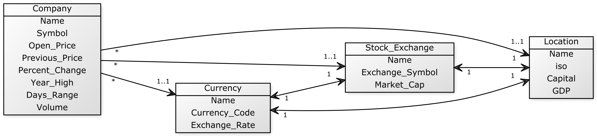

# Downing Jones 

Full stack web application that displays and compares stock market information from different markets simultaneously.

Forked from this [repo](https://github.com/kelvinhe273/IDB-Group7), which was the original repo for the group project. For documentation, see [wiki](https://github.com/qirh/jones/wiki).

## Database Model (UML)

## Author's notes
#### Known issues
* API is down
#### Still hasn't been implemented nada
#### To add
#### To improve
* Edit pics